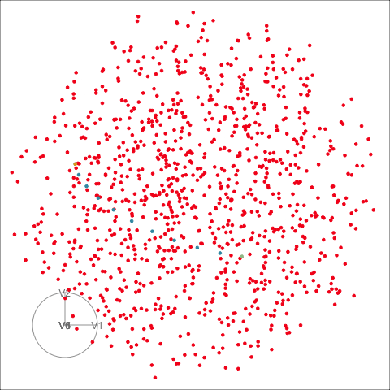

```{r setup, include=FALSE}
knitr::opts_chunk$set(echo = FALSE, 
                      warning = FALSE, 
                      message = FALSE)
```

```{r load}
library(tourr)
library(tidyverse)
library(woylier)
library(geozoo)
library(ggplot2)
library(patchwork)
library(gganimate)
library(GGally)
library(corrplot)
```

# Introduction

When data has up to three variables, visualization is relatively intuitive, while with more than three variables, we face the challenge of visualizing high dimensions on 2D screens. This issue was tackled by grand tour @asimov_1985 which can be used to view data in more than three dimensions using linear projections. It is based on the idea of rotations of a lower-dimensional projection in high-dimensional space. Grand tour allows users to see dynamic 2D projections of higher dimensional space. Originally, Asimov's grand tour presents the viewer with an automatic movie of projections with no user control. Since then lots of work has been done about the interactivity of the tour giving control to users [@buja_cook_asimov_hurley_2005]. The alternatives to the grand tour include manual tour, little tour, guided tour, local tour, and planned tour. These are different ways of selecting a basis for projection. 

The guided tour combines projection pursuit with the tour [@grandtour1995] and it is implemented in the \CRANpkg{tourr} package. The idea of projection pursuit is a procedure used to locate the projection of high-to-low dimensional space that exposes the most interesting feature of data originally proposed by @kruskal_1969. It involves defining a criterion of interest, a numerical objective function, that indicates the interestingness of each projection and selecting planes with increasing values of the function. In the literature, a number of such criteria have been developed based on clustering, spread, and outliers. 

A tour path is a sequence of projection and we use interpolation method to produce the path. The current implementation of guided tour in \CRANpkg{tourr} package uses geodesic interpolation between planes. Geodesic interpolation path is the locally shortest path between planes with no within-plane spin. As a result of this method, the rendered target plane could be the rotated version of the target plane we wanted. This is not a problem when the structure we are looking can be identified without turning the axis around. The detailed discussion about the role of orientation in data projection can be found in @Buja2004TheoryOD.

However, in some cases of non-linear projection pursuit index, the orientation of frames does matter. One example is the splines2D index. The value of the splines2D index [@Grimm2016] changes depending on the rotation [@pp]. The lack of rotation invariance of the splines2d index raises complications in the optimization process. This rotational dependence issue of non-linear projection pursuit functions is the motivation of this work. Figure `r knitr::asis_output(ifelse(knitr::is_html_output(), '\\@ref(fig:splines2d-static)', '\\@ref(fig:splines2d-static)'))` illustrates the rotational invariance problem for a modified spline2D index. The original implementation for the splines2d index makes a couple of additional calculations to reduce (but not remove) the rotational invariance. Our modified index computes the splines on one orientation, exaggerating the rotational variability. The example data was simulated to follow a sine curve and the modified splines index is calculated on different within-plane rotations of the data. Although they have the same structure, the index values vary greatly. The goal with the frame to frame interpolation is that optimization would find the best within-plane rotation, and thus appropriately optimize the index. 

```{r splines2d-static, out.width = "100%", fig.width = 9, fig.height = 4.5, layout = "l-body", fig.cap="Modified spline index computed on within-plane rotations of the same projection has very different values: (a) original pair has maximum index value of 1.00, (b) axes rotated 45$^o$ drops index value to 0.83, (c) axes rotated 60$^o$ drops index to a very low 0.26. This shows an index that is rotationally variable.", fig.alt = "Three side-by-side scatterplots. The left side plot shows two variables, V5, V6, with a sine curve. The index value is the maximum of 1. The middle plot shows the two variables rotated 45 degrees clock-wise, and the calculated index value is 0.83. The right-side plot is rotated 60 degrees, and the calculated index value is 0.26."}
data("sine_curve")

# modified the splines2d
new_splines2d <- function ()
{
  function(mat) {
    mat <- as.data.frame(mat)
    colnames(mat) <- c("x", "y")
    kx <- ifelse(length(unique(mat$x[!is.na(mat$x)])) < 20,
                 3, 10)
    mgam1 <- mgcv::gam(y ~ s(x, bs = "cr", k = kx), data = mat)
    measure <- 1 - var(residuals(mgam1), na.rm = T)/var(mat$y, na.rm = T)
    return(measure)
  }
}
mat <- data.frame(sine_curve[,5:6])
mat_idx <- round(new_splines2d()(mat), 2)
rot1 <- matrix(c(cos(pi/4), sin(pi/4), 
                -sin(pi/4), cos(pi/4)),
              ncol=2, byrow=T)
mat_rot1 <- data.frame(x = rot1[1,1] * sine_curve$V5 + 
                          rot1[1,2] * sine_curve$V6,
                      y = rot1[2,1] * sine_curve$V5 + 
                           rot1[2,2] * sine_curve$V6)
mat_rot1_idx <- round(new_splines2d()(mat_rot1), 2)
rot2 <- matrix(c(cos(pi/3), sin(pi/3), 
                -sin(pi/3), cos(pi/3)),
              ncol=2, byrow=T)
mat_rot2 <- data.frame(x = rot2[1,1] * sine_curve$V5 + 
                          rot2[1,2] * sine_curve$V6,
                      y = rot2[2,1] * sine_curve$V5 + 
                           rot2[2,2] * sine_curve$V6)
mat_rot2_idx <- round(new_splines2d()(mat_rot2), 2)

p1 <- ggplot(mat, aes(x=V5, y=V6)) + 
  geom_point() + 
  geom_segment(data=tibble(cnt=c(0,0), V5=c(1,0), V6=c(0,1)), mapping=aes(x=cnt, xend=V5, y=cnt, yend=V6)) +
  geom_text(data=tibble(V5=c(1,0), V6=c(0,1), label=c("V5", "V6")), aes(x=V5, y=V6, label=label)) +
  xlim(c(-1.2, 1.2)) + ylim(c(-1.2, 1.2)) +
  xlab("Proj 1") + ylab("Proj 2") +
  ggtitle(paste("a. 0 deg: ", mat_idx)) +
  theme_bw() +
  theme(aspect.ratio=1)
p2 <- ggplot(mat_rot1, aes(x=x, y=y)) + 
  geom_point() + 
  geom_segment(data=tibble(cnt=c(0,0), V5=rot1[1,], V6=rot1[2,]), mapping=aes(x=cnt, xend=V5, y=cnt, yend=V6)) +
  geom_text(data=tibble(V5=rot1[1,], V6=rot1[2,], label=c("V5", "V6")), aes(x=V5, y=V6, label=label)) +
  xlim(c(-1.2, 1.2)) + ylim(c(-1.2, 1.2)) +
  xlab("Proj 1") + ylab("Proj 2") +
  ggtitle(paste("b. 45 deg: ", mat_rot1_idx)) +
  theme_bw() +
  theme(aspect.ratio=1)
p3 <- ggplot(mat_rot2, aes(x=x, y=y)) + 
  geom_point() + 
  geom_segment(data=tibble(cnt=c(0,0), V5=rot2[1,], V6=rot2[2,]), mapping=aes(x=cnt, xend=V5, y=cnt, yend=V6)) +
  geom_text(data=tibble(V5=rot2[1,], V6=rot2[2,], label=c("V5", "V6")), aes(x=V5, y=V6, label=label)) +
  xlim(c(-1.2, 1.2)) + ylim(c(-1.2, 1.2)) +
  xlab("Proj 1") + ylab("Proj 2") +
  ggtitle(paste("c. 60 deg: ", mat_rot2_idx)) +
  theme_bw() +
  theme(aspect.ratio=1)
p1+p2+p3
```

A few alternatives to geodesic interpolation were proposed by @buja_cook_asimov_hurley_2005 including the decomposition of orthogonal matrices, Givens decomposition, and Householder decomposition. The purpose of the **woylier** package is to implement the Givens paths method in R. This algorithm adapts Given's matrix decomposition technique which allows the interpolation to be between frames rather than planes.

This article is structured as follows. The next section provided the theoretical framework of the Givens interpolation method followed by a section about the implementation Givens path in R. Furthermore, we will apply this interpolation method to the projection pursuit of splines index to search for nonlinear associations between variables in the example data set. Finally, this article includes a discussion about the further steps. 

# Background

The tour method of visualization is animated high-to-low dimensional data rotation that is a movie, one-parameter (time) family of static projections. Algorithms for such dynamic projections @buja_cook_asimov_hurley_2005 are based on the idea of smoothly interpolating a discrete sequence of projections. 

The topic of this article is the construction of paths of projections. Interpolation of paths of projection can be compared to connecting line segments that interpolate points in Euclidean space. Interpolation acts as a bridge between continuous animation and discrete choice of sequences of projections. 

**The interpolating paths of plane versus frames**

Current implementation of \CRANpkg{tourr} package is locally shortest (geodesic) interpolation of planes. The pitfall of this interpolation method is that it does not account for rotation variability. Therefore, the interpolation of frames is required when the orientation of projection matters. If the rendering on a frame and on the rotated version of the frame yields the same visual scenes, it means the orientation does not matter. 

The orientation of frames could be important when non-linear projection pursuit function is used in guided tour. An illustration of such cases are shown in Figure `r knitr::asis_output(ifelse(knitr::is_html_output(), '\\@ref(fig:dogs)', '\\@ref(fig:dogs)'))`.

```{r dogs, echo=FALSE, out.width="45%", fig.align = "center", fig.show='hold', fig.cap="Plane to plane interpolation (left) and Frame to frame interpolation (right). We used dog index for illustration purposes. For some non-linear index orientation of data could affect the index."}
knitr::include_graphics(
  c("plane.png",
    "frame.png"))
```

Before continuing with the interpolation algorithms, we need to define the notations. 

- Let the $p$ be the dimension of original data and $d$ be the dimension onto which the data is being projected. 

- A frame $F$ is defined as $p\times d$ matrix with pairwise orthogonal columns of unit length that satisfies, where $I_d$ is the identity matrix in d dimensions. 

$$F^TF = I_d$$ 

- Paths of projections are given by continuous one-parameter families $F(t)$ where $t\in [a, z]$ interval representing time. We denote the starting frame by $F_a = F(a)$ and target frame by $F_z = F(z)$. Usually, $F_z$ is selected target basis that has chosen via various methods. While grand tour chooses target frames randomly, guided tour chooses the target plane by optimizing the projection pursuit index. Interpolation methods are used to move from $F_a$ to $F_z$.

- $B$ is preprojection basis of $F_a$ and $F_z$.

**Preprojection algorithm**

In order to make the interpolation algorithm simple, we need to carry out "preprojection" step. 
The purpose of preprojection is to limit data subspace that the interpolation path, $F(t)$, is traversing. In other words, preprojection step make sure the interpolation path between two frames $F_a$ and $F_z$ is not going to the data space that is not related to $F_a$ and $F_z$. Simply, prepojection algorithm is defining the joint subspace of $F_a$ and $F_z$. 

The procedure starts with forming an orthonormal basis by applying Gram-Schmidt to $F_z$ with regard to $F_a$. We denote this orthonormal basis by $F_\star$. Then build preprojection basis $B$ by combining $F_a$ and $F_\star$ as follows:

$$B = (F_a, F_{\star})$$

The dimension of the resulting orthonormal basis, $B$, is $p\times 2d$.

Then, we can express the original frames in terms of this basis:

$$F_a = B^TW_a, F_z = B^TW_z$$

The interpolation problem is then reduced to the construction of paths of frames $W(t)$ that interpolate the preprojected frames $W_a$ and $W_z$. Because $B$ is orthonormalized basis of $F_z$ with regard to $F_a$, $W_a$ is $2d\times d$ matrix of 1, 0s. This is an important character for our interpolation algorithm of choice, Givens interpolation. 

**Givens interpolation path algorithm**

A rotation matrix is a transformation matrix used to perform a rotation in Euclidean space in a plane. A rotation matrix that transforms 2-D plane by an angle $\theta$ looks like this:

$$ \begin{bmatrix}\cos \theta &-\sin \theta \\\sin \theta &\cos \theta \end{bmatrix} $$

If the rotation is in the plane of selected 2 variables, it is called Givens rotation. Let's denote those 2 variables $i$ and $j$. The Givens rotation is useful for introducing zeros on a grand scale and used for computing the QR decomposition of matrix in linear algebra problems. One advantage over other transformation methods which is particularly useful in our case is the ability to zero elements more selectively.

The interpolation methods in the **woylier** package is based on the fact that in any vector of a matrix, one can zero out the $i$-th coordinate with a Givens rotation in the $(i, j)$-plane for any $j\neq i$. This rotation affects only coordinate $i$ and $j$ and leave all other coordinates unchanged. 

Sequences of Givens rotations can map any orthonormal d-frame F in p-space to standard d-frame $E_d=((1, 0, 0, ...)^T, (0, 1, 0, ...)^T, ...)$. 

The interpolation path construction algorithm from starting frame $F_a$ to target frame $F_z$ is illustrated below. The example is 2D path construction process of original 6D data frame. 

1. Construct preprojection basis $B$ by orthonormalizing $F_z$ with regards tp $F_a$ with Gram-Schmidt.

In our example, $F_a$ and $F_z$ are $p\times d$ or $6\times2$ matrices that are orthonormal. The preprojection basis $B$ is $p\times 2d$ matrix that is $6\times 4$.

2. Get the preprojected frames using the preprojection basis $B$.
$$W_a = B^TF_a = E_d$$ and $$W_z = B^TF_z$$

In our example, $W_a$ looks like:


$$ \begin{bmatrix}1 & 0 \\0  &1 \\ 0&0 \\0&0\end{bmatrix} $$

$W_z$ is orthonormal $2d\times d$ matrix that looks like:

$$ \begin{bmatrix} a_{11} & a_{12} \\a_{21}  &a_{22} \\ a_{31}&a_{32} \\a_{41}&a_{42}\end{bmatrix} $$


3. Then, we can construct a sequence of Givens rotations that maps $W_z$ to $W_a$ with such angles that makes one element zero at a time:

$$ W_a = R_m(\theta_m) ... R_2(\theta_2)R_1(\theta_1)W_z$$ 

At each rotation, the angle $\theta_i$ that zero out the second coordinate of a plane is calculated.

When $d = 2$, there are 5 rotations involved with 5 different angles that makes each elements 0. For example, the first rotation angle $\theta_1$ is an angle in radian between $(1, 0)$ and $(a_{11}, a_{21})$. This rotation matrix would make element $a_{21}$ zero:

$$R_1(\theta_1) = G(1, 2, \theta_1) = \begin{bmatrix} cos\theta_1 & -sin\theta_1 & 0 & 0 \\sin\theta_1  &cos\theta_1 & 0 &0 \\ 0&0&1&0 \\0&0&0&1\end{bmatrix}$$

6th rotation is not necessary due to orthonormality of columns. If we make one element of a column 1 that means all other elements must be 0. 

4. The inverse mapping is obtained by reversing the sequence of rotations with the negative of the angles, we starts from the starting basis and end at the target basis. 

$$R(\theta) = R_1(-\theta_1) ... R_m(-\theta_m), \    W_z = R(\theta)W_a$$

Performing these rotations would go from the starting frame to the target frame in one step. But we want to do it sequentially in a number of steps so interpolation between frames looks dynamic. 

5. Next step should include the time parameter, $t$, so that it shows the interpolation process rendered in the movie-like sequence. We break $\theta_i$ into the number of steps, $n-step$, that we want to go from starting frame to the target frame, which means it moves by equal angle in each step. 

6. Finally, we reconstruct our original frames using $B$. This reconstruction is done at each step of interpolation so that we have interpolated path as result. We use $F_t$ to project the orignal data into lower dimensions.

$$F_t = B  W_t$$

**Projection pursuit index functions**

The properties of several projection pursuit index functions were investigated.[@pp] The smoothness, squintability, flexibility, rotation invariance, and speed of projection pursuit index functions were examined. The one property that is interesting to us is rotation invariance. The rotational invariance is examined by computing projection pursuit index for different rotations within 2D plane. It is established that the dcor2d, splines2d and TIC index are  not rotationally invariant. Splines2D index measures nonlinear association between variable by fitting spline model. It compares the variance of residuals and the functional dependence is stronger if the index value is larger.

# Implementation

We implemented each steps mentioned in **Givens interpolation path algorithm** in separate functions and combined them in *givens_full_path()* function. Here is the input and output of each functions and it's descriptions.


- `givens_full_path(Fa, Fz, nsteps)`: Construct full interpolated frames.   
    - `input`: Starting and target frame (Fa, Fz) and number of steps 
    - `output`: An array with nsteps matrix. Each matrix is interpolated frame in between starting and target frames. 
- `preprojection(Fa, Fz)`: Build a d-dimensional pre-projection space by orthonormalizing Fz with regard to Fa.
    - `input`:  Starting and target frame (Fa, Fz) 
    - `output`: B pre-projection px2d matrix 
- `construct_preframe(Fa, B)`: Construct preprojected frames.
    - `input`: A frame and the pre-projection px2d matrix
    - `output`: Preprojected frame in preprojection space
- `row_rot(a, i, k, theta)`: Performs Givens rotation [@matrix_computation].
    - `input`: a-matrix, i-row, k-row that we want to zero the element, theta-angle between i, k rows
    - `output`: theta angle rotated matrix a 
- `calculate_angles(Wa, Wz)`: Calculate angles of required rotations to map Wz to Wa.
    - `input`:  Preprojected frames (Wa, Wz)
    - `output`: Names list of angles
- `givens_rotation(Wa, angles, stepfraction)`: It implements series of Givens rotations that maps Wa to Wz
    - `input`: Wa starting preprojected frame, list of angles of required rotations to map Wz to Wa, stepfraction.
    - `output`: Givens path 
- `construct_moving_frame(Wt, B)`: Reconstruct interpolated frames using pre-projection. 
    - `input`: Pre-projection matrix B, Each frame of givens path
    - `output`: A frame of on a step of interpolation

The interface of tour is that it renders one projection of data at a time. It displays one projection and asks for the next projection. Therefore, path of projections shown below is sequence of projections to be renders at tour display.

The *givens_full_path()* function returns the intermediate interpolation step projections in given number of steps. The code chunk below demonstrates the interpolation between 2 random basis in 5 steps.

```{r echo=TRUE}
set.seed(2022)
p <- 6
base1 <- tourr::basis_random(p, d=2)
base2 <- tourr::basis_random(p, d=2)

base1
base2
```

```{r echo=TRUE}
givens_full_path(base1, base2, nsteps = 5)
```


# Examples of interpolated paths

In this section, we illustrate the use of *givens_full_path()* function by plotting the interpolated path between 2 frames. This also a way of checking if interpolated path is moving in equal size at each step.

For plotting the interpolated path of projections, we used \CRANpkg{geozoo} package [@geozoo]. 1D projection is plotted on unit sphere, while 2D projection is visualized on torus. The points on the surface of sphere and torus shape are randomly generated by functions from the \CRANpkg{geozoo} package.

**Interpolated paths of 1D projection**

1D projection of data in high dimension linear combination of data that is normalized. Therefore, we can plot the point on the surface of a hypersphere. Figure `r knitr::asis_output(ifelse(knitr::is_html_output(), '\\@ref(fig:1d-path-dynamic)', '\\@ref(fig:1d-path-static)'))` shows the Givens interpolation steps between 2 points, 1D projection of 6D data that is. 

```{r echo = FALSE, eval=FALSE}
set.seed(2022)
p <- 6
base1 <- tourr::basis_random(p, d=1)
base2 <- tourr::basis_random(p, d=1)

frames <- givens_full_path(base1, base2, nsteps = 10)

sp <- generate_space_view(p=p)

sp_path <- add_path(sp, frames)

point1 <- as.data.frame(t(base1))
point1$type <- "point1"

point2 <- as.data.frame(t(base2))
point2$type <- "point2"

sp_path <- rbind(sp_path, point1, point2)

tourr::render_gif(sp_path[,1:p], 
                  tour_path = grand_tour(),
                  display = display_xy(axes="bottomleft", col=sp_path$type),
                  frames = 100,
                  "sphere.gif")
```

```{r 1d-path-dynamic, out.width="50%", fig.align="center", echo = FALSE, fig.height = 3, fig.cap="Interpolation steps of 1D projections of 6D data", include=knitr::is_html_output(), eval=knitr::is_html_output(), fig.alt = "2 highlighted points on the surface of sphere connected by 10 interpolated steps, rotating."}

```

```{r 1d-path-static, out.width="50%", fig.align="center", echo = FALSE, fig.height = 3, fig.cap="Interpolation steps of 1D projections of 6D data", include=knitr::is_latex_output(), eval=knitr::is_latex_output(), fig.alt = "2 highlighted points on the surface of sphere connected by 10 interpolated steps, rotating."}
knitr::include_graphics("sphere_static.png")
```

**Interpolated paths of 2D projection**

In case of 2D projections, we can plot the interpolated path between 2 frames on the surface of torus. Torus can be seen as crossing of 2 circles that are orthonormal. Figure `r knitr::asis_output(ifelse(knitr::is_html_output(), '\\@ref(fig:2d-path-dynamic)', '\\@ref(fig:2d-path-static)'))` shows the Givens interpolation steps in 2D projection of 6D data. 

```{r echo = FALSE, eval=FALSE}
set.seed(2022)
p <- 6
n <- 1500
d <- 2
base1 <- tourr::basis_random(p, d=2)
base2 <- tourr::basis_random(p, d=2)
frames_2d <- givens_full_path(base1, base2, 10)
proj_2d <- map(1:n, ~basis_random(n = p,  d=d)) %>%
  purrr::flatten_dbl() %>% 
  matrix(ncol = p*2, byrow = TRUE) %>%
  as_tibble()
path_2d <- t(apply(frames_2d, 3, c)) %>% 
  as.data.frame()
proj_2d <- proj_2d %>% 
  mutate(type="torus")
path_2d <- path_2d %>% 
  mutate(type="path")
proj_path <- bind_rows(proj_2d, path_2d)

tourr::render_gif(proj_path[,1:6], 
                  tour_path = grand_tour(),
                  display = display_xy(axes="bottomleft", col=proj_path$type),
                  frames = 100,
                  "torus.gif")
```

```{r 2d-path-dynamic, out.width="50%", fig.align="center", echo = FALSE, fig.height = 3, fig.cap="Interpolation steps of 2D projections of 6D data", include=knitr::is_html_output(), eval=knitr::is_html_output(), fig.alt = "2 highlighted points on the surface of torus connected by 10 interpolated steps, rotating."}

knitr::include_graphics("torus.gif")
```

```{r 2d-path-static, out.width="50%", fig.align="center", echo = FALSE, fig.height = 3, fig.cap="Interpolation steps of 2D projections of 6D data", include=knitr::is_latex_output(), eval=knitr::is_latex_output(), fig.alt = "2 highlighted points on the surface of torus connected by 10 interpolated steps, rotating."}

knitr::include_graphics("torus_static.png")
```

# Comparison of geodesic interpolation and Givens interpolation

In this section, we used simulated data for comparing geodesic and Givens interpolation paths. The data has 6 variables and 500 observations. The variable 5 and 6 has sine structure and the remaining variables are randomly generated from normal distribution. The sine is non-linear structure and can be detected using splines2d index. 

Figure `r knitr::asis_output(ifelse(knitr::is_html_output(), '\\@ref(fig:compare-interpolations)', '\\@ref(fig:compare-interpolations-static)'))` shows the Geodesic and Givens interpolation to target frame where the two variables forms sine curve. 

```{r echo = FALSE, eval=FALSE}
# Generate a sample interpolation
set.seed(5543)
base1 <- tourr::orthonormalise(tourr::basis_random(6, d=2))
base2 <- matrix(c(0, 0, 0, 0, 0, 0, 0, 0, 1, 0, 0, 1), ncol=2, byrow=T)
sine_path <- givens_full_path(base1, base2, nsteps=100)
sine_all <- NULL
sine_proj <- NULL
for (i in 1:dim(sine_path)[3]) {
  d <- as.matrix(sine_curve) %*% as.matrix(sine_path[,,i])
  d <- data.frame(d)
  d$idx <- round(tourr::splines2d()(d), 2)
  d$frame <- i
  sine_all <- bind_rows(sine_all, d)
  prj <- as.data.frame(sine_path[,,i])
  prj$frame <- i
  prj$names <- colnames(sine_curve)
  sine_proj <- bind_rows(sine_proj, prj)
}
sine_label <- sine_all %>%
  mutate(labelX = -1, labelY = 1.45, label_idx = paste0("spl=", format(idx, digits=2)))
sine_proj <- sine_proj %>%
  mutate(cx = 0, cy = 0)
# With gganimate

sine_anim <- ggplot() +
  geom_segment(data=sine_proj, aes(x=V1, y=V2,
                                   xend=cx, yend=cy,
                                   group=frame),
               colour="grey60") +
  geom_text(data=sine_proj, aes(x=V1, y=V2,
                                label=names,
                                group=frame),
               colour="grey60") +
  geom_point(data=sine_label, aes(x=X1, y=X2)) +
  geom_text(data=sine_label, aes(x=labelX, y=labelY,
                label=label_idx), size=10) +
  xlab("") + ylab("") +
  transition_time(frame) +
  theme_void() +
  theme(aspect.ratio=1,
        plot.background = element_rect(fill=NULL, colour = "black"))

animate(sine_anim, fps=8, renderer = gifski_renderer(loop = TRUE), width=400, height=400)
anim_save("sine_anim_givens.gif")
```


```{r echo = FALSE, eval=FALSE}
library(tourr)
set.seed(5541)
base1 <- tourr::orthonormalise(tourr::basis_random(6, d=2))
base2 <- matrix(c(0,0,0,0,0,0,0,0,1, 0, 0, 1), ncol = 2, byrow = TRUE)
basis_set <- array(dim = c(6,2,2))
basis_set[,,1] <- base1
basis_set[,,2] <- base2
attr(basis_set, "class") <- c("history_array", class(basis_set))
path_geo <- tourr::interpolate(basis_set, angle = 0.0151)
data("sine_curve")

sine_all <- NULL
sine_proj <- NULL
for (i in 1:dim(path_geo)[3]) {
  d <- as.matrix(sine_curve) %*% matrix(c(path_geo[,,i][[1]]), ncol = 2)
  d <- data.frame(d)
  d$idx <- round(tourr::splines2d()(d), 2)
  d$frame <- i
  sine_all <- bind_rows(sine_all, d)
  prj <- as.data.frame(matrix(c(path_geo[,,i][[1]]), ncol = 2))
  prj$frame <- i
  prj$names <- colnames(sine_curve)
  sine_proj <- bind_rows(sine_proj, prj)
}
sine_label <- sine_all %>%
  mutate(labelX = -1, labelY = 1.45, label_idx = paste0("spl=", format(idx, digits=2)))
sine_proj <- sine_proj %>%
  mutate(cx = 0, cy = 0)

# With gganimate
sine_anim <- ggplot() +
  geom_segment(data=sine_proj, aes(x=V1, y=V2,
                                   xend=cx, yend=cy,
                                   group=frame),
               colour="grey60") +
  geom_text(data=sine_proj, aes(x=V1, y=V2,
                                label=names,
                                group=frame),
               colour="grey60") +
  geom_point(data=sine_label, aes(x=X1, y=X2)) +
  geom_text(data=sine_label, aes(x=labelX, y=labelY,
                label=label_idx), size=10) +
  xlab("") + ylab("") +
  transition_time(frame) +
  theme_void() +
  theme(aspect.ratio=1,
        plot.background = element_rect(fill=NULL, colour = "black"))

animate(sine_anim, fps=8, renderer = gifski_renderer(loop = TRUE), width=400, height=400)
anim_save("sine_anim_geodesic.gif")
```


```{r compare-interpolations, echo=FALSE, out.width="50%", fig.align = "center", fig.show='hold', include=knitr::is_html_output(), eval=knitr::is_html_output(), fig.cap="Givens interpolation path (left) and Geodesic interpolation path (right) to target frame. Givens interpolation goes to exact frame that has the correct orientation while Geodesic interpolation goes to rotation of the target plane."}
knitr::include_graphics(
  c("sine_anim_givens.gif",
    "sine_anim_geodesic.gif"))
```

```{r compare-interpolations-static, echo=FALSE, out.width="50%", fig.align = "center", fig.show='hold', include=knitr::is_latex_output(), eval=knitr::is_latex_output(), fig.cap="Givens interpolation path (left) and Geodesic interpolation path (right) to target frame. Givens interpolation goes to exact frame that has the correct orientation while Geodesic interpolation goes to rotation of the target plane."}
knitr::include_graphics(
  c("given_sine.png",
    "geodesic_sine.png"))
```

# Data application

This section describes the application of Givens interpolation path with guided tour to explore non-linear association in multivariate data. 

We have cross-rates for currencies relative to the US dollar. A cross-rate is an exchange rate between two currencies computed by reference to a third currency, usually the US dollar. 

The data was extracted from [openexchangerates](https://openexchangerates.org) and contains cross-rate for ARS, AUD, EUR, JPY, KRW, MYR between 2019-11-1 to 2020-03-31. Figure `r knitr::asis_output(ifelse(knitr::is_html_output(), '\\@ref(fig:currency)', '\\@ref(fig:currency)'))` shows how the currencies changed relative to USD over the time period. We see some collective behavior in March of 2020 with EUR and JPY increasing in a similar manner, and smaller currencies decreasing in value. This could be understood as a consequence of flight-to-quality at this uncertain times.  

```{r currency, out.width="100%", fig.width = 9, fig.height = 4.5, layout = "l-body", fig.cap="All the currencies are standardised and the sign is flipped. The high value means the currency strengthened against the USD, and low means that it weakened."}
rates <- read_csv("rates_Nov19_Mar20.csv", show_col_types = FALSE) %>% 
  select(date, ARS, AUD, EUR, JPY, KRW, MYR) 
rates_sub <- rates %>%
  mutate_if(is.numeric, function(x) -1*(x-mean(x))/sd(x))
rates_sub_long <- rates_sub %>% 
  pivot_longer(cols=ARS:MYR, 
               names_to="currency",
               values_to="crossrate") 
ggplot(rates_sub_long, aes(x=date, y=crossrate, colour=currency)) +
  geom_line() +
  scale_colour_brewer("", palette = "Dark2") +
  theme_bw() +
  theme(aspect.ratio = 0.3,
        legend.position = "bottom")
# saving months for coloring in later
rate_march <- lubridate::month(rates$date)==3
```

We are interested in capturing this relations over time, and from the time series visualization we expect that we can capture the main dynamics in a two-dimensional projection from the six-dimensional space of currencies. Thus we start from $p=6$ (the different currencies) and $n=152$ the number of days in our sample. We expect that a projection onto $d=2$ dimensions should capture the relation between the two groups of currencies mentioned above, and this should be identified within the noise of the random fluctuations.

**PCA result**

Since the collective behavior observed in March 2020 clearly stands out in the time series display, we may expect that we can capture the dependence between the two groups using principal components analysis. Figure \@re(pca-result-static)
<!--`r knitr::asis_output(ifelse(knitr::is_html_output(), '\\@ref(fig:pca-result)', '\\@ref(fig:pca-result)'))`--> shows a scatter plot matrix of the PCs of our dataset. Indeed we find strong non-linear association between the first two PCs. Investigation of the rotation shows that the first principal component is primarily a balanced combination between ARS, AUD, KRW and MYR (and a smaller contribution of EUR), and the second contribution is dominated by EUR and JPY contrasted with smaller contributions from ARS and MYR. Our next step is thus to use projection pursuit to identify the best projection matrix that captures the non-linear functional dependence.

```{r pca-result-static, echo=FALSE, out.width="80%", fig.width=8, fig.height=8, fig.align = "center", fig.show='hold', fig.cap="There is a strong non-linear dependence between PC1 and PC2. Observations in March 2020 are highlighted in dark blue, all other months are shown in grey."}
# Use PCA to remove linear dependence
rates_pca <- prcomp(rates[,-1], scale. = TRUE)
pca <- ggscatmat(cbind(tibble::as_tibble(rates_pca$x), rate_march),
                 color = "rate_march") +
  scale_color_manual(values = c("grey", "darkblue")) +
  theme_bw() +
  theme(aspect.ratio = 1,
        legend.position = "none")
pca
```

<!--
```{r pca-result, echo=FALSE, out.width="50%", fig.align = "center", fig.show='hold', include=knitr::is_html_output(), eval=knitr::is_html_output(), fig.cap="There is a strong non-linear dependence between PC1 and PC2."}
# Use PCA to remove linear dependence
rates_pca <- prcomp(rates[,-1], scale. = TRUE)
pca <- ggscatmat(rates_pca$x)
pca
```
-->

**New splines2d index**

We now use the splines index to identify a projection with functional dependence between the first and second direction of the projection. Note here that because of strong linear correlations between the currencies, we start from the first five principal components, explaining over 99% of the variance in the data. We start the optimization from a random projection to avoid starting from the view previously identified in the first two principal components, and we use the PCA display in `tourr` to show the projection in terms of the original variables.

```{r}
rates_pca_sd <-  apply(rates_pca$x, 2, function(x) (x-mean(x))/sd(x))
```

```{r echo = FALSE, eval=FALSE}
# modified the splines2d
new_splines2d <- function ()
{
  function(mat) {
    mat <- as.data.frame(mat)
    colnames(mat) <- c("x", "y")
    kx <- ifelse(length(unique(mat$x[!is.na(mat$x)])) < 20,
                 3, 10)
    mgam1 <- mgcv::gam(y ~ s(x, bs = "cr", k = kx), data = mat)
    measure <- 1 - var(residuals(mgam1), na.rm = T)/var(mat$y, na.rm = T)
    return(measure)
  }
}

col_rates <- rep("grey", nrow(rates))
col_rates[rate_march] <- "darkblue"
basis_start <- matrix(rep(0, 8), ncol = 2)
basis_start[3,1] <- 1
basis_start[4,2] <- 1
set.seed(2023)
record_search_geodesic <- animate_pca(rates_pca_sd[,1:4], pc_coefs = rates_pca$rotation[,1:4],
            tour_path = guided_tour(new_splines2d(), current = basis_start),
            col = col_rates)
set.seed(2023)
record_search_givens <- animate_pca(rates_pca_sd[,1:4], pc_coefs = rates_pca$rotation[,1:4],
           tour_path = guided_tour_givens(new_splines2d(),
                                          current = basis_start,
                                          optim = "search_better",
                                          max.tries = 100,
                                          alpha = 1),
           col = col_rates)
set.seed(2023)
record_search_better <-animate_pca(rates_pca_sd[,1:4], pc_coefs = rates_pca$rotation[,1:4],
           tour_path = guided_tour(new_splines2d(),
                                          current = basis_start,
                                          search_f = search_better,
                                          max.tries = 100,
                                          alpha = 1),
           col = col_rates)
```

```{r echo=FALSE, eval=FALSE}
library(ferrn)
get_interp(record_search_geodesic) %>%
  ggplot(aes(id, index_val)) +
  geom_line() +
  geom_point(data = dplyr::bind_rows(get_start(record_search_geodesic),
                                     get_interp_last(record_search_geodesic))) +
  ylim(0,1)

             
get_interp(record_search_better) %>%
  ggplot(aes(id, index_val)) +
  geom_line() +
  geom_point(data = dplyr::bind_rows(get_start(record_search_better),
                                     get_interp_last(record_search_better))) +
  ylim(0,1)          

get_interp(record_search_givens) %>%
  ggplot(aes(id, index_val)) +
  geom_line() +
  geom_point(data = dplyr::bind_rows(get_start(record_search_givens),
                                     get_interp_last(record_search_givens))) +
  ylim(0,1)
```

What do we learn from looking at the traces?

- geodesic search does not have problem from rotation dependent index because it is searching along geodesic path, so everything is consistent, but it can get stuck and cannot jump to better solutions
- instead we might want to use random search (simulated annealing), but here we have huge problems from the rotation dependence of the index - even though this search should only accept target planes with higher index values we get big drops just because of the change in index value after rotation, the search path is very long and cannot find a good optimum
- using givens interpolation with the random search can fix these issues, we can step across valleys with lower index values but each target plane is increasing the index value, we do not need to restart the search - even with longer interpolations from the within-plane rotation this search is much more efficient (shorter path), the final index value in our run is above what the random search with geodesic interpolation has found, the final view is certainly more interesting


```{r guided-geo-dynamic, out.width="50%", fig.align="center", echo = FALSE, fig.height = 3, fig.cap="Guided tour optimization of splines index using geodesic interpolation.", include=knitr::is_html_output(), eval=knitr::is_html_output()}
#knitr::include_graphics("guided_geo.gif")
```

Value  0.826   0.0 % better 
No better bases found after 25 tries.  Giving up.
Final projection: 
0.855  -0.231  
-0.294  0.465  
0.268  0.758  
-0.333  -0.394  

```{r guided-geo-static, out.width="50%", fig.align="center", echo = FALSE, fig.height = 3, fig.cap="Guided tour optimization of splines index using geodesic interpolation.", include=knitr::is_latex_output(), eval=knitr::is_latex_output()}
#knitr::include_graphics("guided_geo.png")
```


```{r guided-givens-dynamic, out.width="50%", fig.align="center", echo = FALSE, fig.height = 3, fig.cap="Guided tour optimization of splines index using Givens interpolation.", include=knitr::is_html_output(), eval=knitr::is_html_output()}
#knitr::include_graphics("guided_givens.gif")
```

Value  0.842   0.0 % better 
No better bases found after 100 tries.  Giving up.
Final projection: 
-0.847  -0.055  
0.399  0.527  
-0.164  0.723  
0.312  -0.442  

```{r guided-givens-static, out.width="50%", fig.align="center", echo = FALSE, fig.height = 3, fig.cap="Guided tour optimization of modified splines index using Givens interpolation.", include=knitr::is_latex_output(), eval=knitr::is_latex_output()}
#knitr::include_graphics("guided_givens.png")
```

```{r guided-givens-random-dynamic, out.width="50%", fig.align="center", echo = FALSE, fig.height = 3, fig.cap="Guided tour optimization of modified splines index using Givens interpolation with better optimization.", include=knitr::is_html_output(), eval=knitr::is_html_output()}
#knitr::include_graphics("guided_givens_random.gif")
```

Value  0.785   0.0 % better 
No better bases found after 100 tries.  Giving up.
Final projection: 
0.835  0.305  
-0.269  -0.462  
0.328  -0.730  
-0.350  0.399  

```{r guided-givens-random-static, out.width="50%", fig.align="center", echo = FALSE, fig.height = 3, fig.cap="Guided tour optimization of modified splines index using Givens interpolation with better optimization.", include=knitr::is_latex_output(), eval=knitr::is_latex_output()}
#knitr::include_graphics("guided_givens_random.png")
```


Conclusions from above

# Conclusion

The R package **woylier** provides implementation of Givens interpolation path algorithm that can be used as an alternative interpolation method for tour. The algorithm implemented in the **woylier** package comes from @buja_cook_asimov_hurley_2005. We illustrate the use of the functions provided in the package for R users.

The motivation to develop this package comes from rotational invariance problem of current geodesic interpolation algorithm implemeneted in \CRANpkg{tourr} package. The package gives users the ability to detect non-linear association between variables more precisely. 

It is important to mention that **woylier** package should be integrated with \CRANpkg{tourr} package. The future improvements that needs to be done in the package is to generalize the interpolation for more than 2d projections of data.
