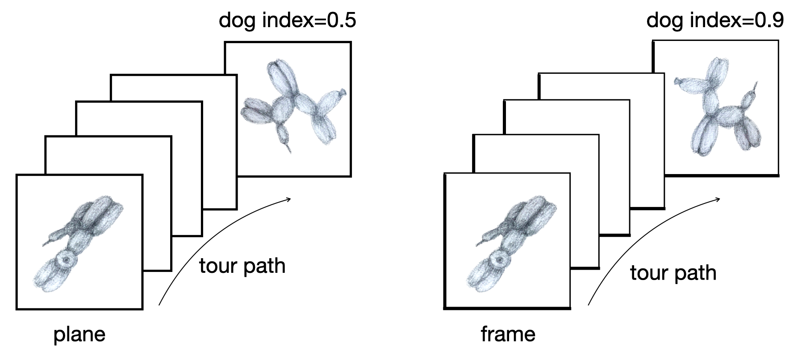

```{r setup, include=FALSE}
knitr::opts_chunk$set(echo = FALSE, 
                      warning = FALSE, 
                      message = FALSE)
```

```{r load}
library(tourr)
library(tidyverse)
library(woylier)
library(geozoo)
library(ggplot2)
library(patchwork)
library(gganimate)
library(GGally)
library(corrplot)
library(kableExtra)
```

# Introduction

When data has up to three variables, visualization is relatively intuitive, while with more than three variables, we face the challenge of visualizing high dimensions on 2D displays. This issue was tackled by the *grand tour* [@asimov_1985] which can be used to view data in more than three dimensions using linear projections. It is based on the idea of rotations of a lower-dimensional projection in high-dimensional space. The grand tour allows users to see dynamic low-dimensional (typically 2D) projections of higher-dimensional space. Originally, Asimov's grand tour presented the viewer with an automatic movie of projections with no user control. Since then new work has added interactivity to the tour, giving more control to users [@buja_cook_asimov_hurley_2005]. New variations include the manual [@cook_manual_1997] or radial tour [@mmtour], little tour, guided tour [@grandtour1995], local tour, and planned tour. These are different ways of selecting the sequence of projection bases for the tour, for an overview see @tourrev.

The guided tour combines projection pursuit with the grand tour and it is implemented in the \CRANpkg{tourr} package [@tourr]. Projection pursuit is a procedure used to locate the projection of high-to-low dimensional space that should expose the most interesting feature of data, originally proposed in @kruskal_1969. It involves defining a criterion of interest, a numerical objective function that indicates the interestingness of each projection, and an optimization for selecting planes with increasing values of the function. In the literature, a number of such criteria have been developed based on clustering, spread, and outliers. 

A tour path is a sequence of projections and we use an interpolation to produce small steps simulating a smooth movement. The current implementation of tour in the \CRANpkg{tourr} package uses geodesic interpolation between planes. The geodesic interpolation path is the shortest path between planes with no within-plane spin (see @Buja2004TheoryOD for more details). As a result, the rendered target plane could be a within-plane rotation of the target plane originally specified. This is not a problem when the structure we are looking for can be identified from any rotation. However, even simple associations in 2D, such as the calculated correlation between variables, can be very different when the basis is rotated.

Most projection pursuit indexes, particularly those provided by in \CRANpkg{tourr} are rotationally invariant. However, there are some applications where the orientation of frames does matter. One example is the splines index proposed by @Grimm2016. The splines index computes a spline model for the two variables in a projection, in order to measure non-linear association. It compares the variance of the response variable to the variance of residuals, and the functional dependence is stronger when the index value is larger. It can be useful to detect non-linear relationships in high-dimensional data. However, its value will change substantially if the projection is rotated within the plane [@pp]. The procedure in @Grimm2016 was less affected by the orientation because it considered only pairs of variables, and it selected the maximum value found when exchanging which variable is considered as a predictor or response variable.


Figure `r knitr::asis_output(ifelse(knitr::is_html_output(), '\\@ref(fig:splines2d-static)', '\\@ref(fig:splines2d-static)'))` illustrates the rotational invariance problem for a modified splines index, where we always consider the horizontal direction as the predictor variable and the vertical direction as the response. Thus, our modified index computes the splines on one orientation, exaggerating the rotational variability. The example data was simulated to follow a sine curve and the modified splines index is calculated on different within-plane rotations of the data. Although they have the same structure, the index values vary greatly. 

The lack of rotation invariance of the splines index raises complications in the optimization process in the projection-pursuit guided tour as available in \CRANpkg{tourr}. Fixing this is the motivation of this work. The goal with the frame-to-frame interpolation is that optimization would find the best within-plane rotation, and thus appropriately optimize the index. 

```{r splines2d-static, out.width = "100%", fig.width = 9, fig.height = 4.5, layout = "l-body", fig.cap="The impact of rotation on a spline index that is NOT rotation invariant. The index value for different within-plane rotations take very different values: (a) original projection has a maximum index value of 1.00, (b) axes rotated 45$^o$ drops index value to 0.83, (c) axes rotated 60$^o$ drops index to a very low 0.26. Geodesic interpolation between planes will have difficulty finding the maximum of an index like this because it is focused only on the projection plane, not the frame defining the plane.", fig.alt = "Three side-by-side scatterplots. The left side plot shows two variables, V5, V6, with a sine curve. The index value is the maximum of 1. The middle plot shows the two variables rotated 45 degrees clockwise, and the calculated index value is 0.83. The right-side plot is rotated 60 degrees, and the calculated index value is 0.26."}
data("sine_curve")

# modified the splines2d
new_splines2d <- function ()
{
  function(mat) {
    mat <- as.data.frame(mat)
    colnames(mat) <- c("x", "y")
    kx <- ifelse(length(unique(mat$x[!is.na(mat$x)])) < 20,
                 3, 10)
    mgam1 <- mgcv::gam(y ~ s(x, bs = "cr", k = kx), data = mat)
    measure <- 1 - var(residuals(mgam1), na.rm = T)/var(mat$y, na.rm = T)
    return(measure)
  }
}
mat <- data.frame(sine_curve[,5:6])
mat_idx <- round(new_splines2d()(mat), 2)
rot1 <- matrix(c(cos(pi/4), sin(pi/4), 
                -sin(pi/4), cos(pi/4)),
              ncol=2, byrow=T)
mat_rot1 <- data.frame(x = rot1[1,1] * sine_curve$V5 + 
                          rot1[1,2] * sine_curve$V6,
                      y = rot1[2,1] * sine_curve$V5 + 
                           rot1[2,2] * sine_curve$V6)
mat_rot1_idx <- round(new_splines2d()(mat_rot1), 2)
rot2 <- matrix(c(cos(pi/3), sin(pi/3), 
                -sin(pi/3), cos(pi/3)),
              ncol=2, byrow=T)
mat_rot2 <- data.frame(x = rot2[1,1] * sine_curve$V5 + 
                          rot2[1,2] * sine_curve$V6,
                      y = rot2[2,1] * sine_curve$V5 + 
                           rot2[2,2] * sine_curve$V6)
mat_rot2_idx <- round(new_splines2d()(mat_rot2), 2)

p1 <- ggplot(mat, aes(x=V5, y=V6)) + 
  geom_point() + 
  geom_segment(data=tibble(cnt=c(0,0), V5=c(1,0), V6=c(0,1)), mapping=aes(x=cnt, xend=V5, y=cnt, yend=V6)) +
  geom_text(data=tibble(V5=c(1,0), V6=c(0,1), label=c("V5", "V6")), aes(x=V5, y=V6, label=label)) +
  xlim(c(-1.2, 1.2)) + ylim(c(-1.2, 1.2)) +
  xlab("Proj 1") + ylab("Proj 2") +
  ggtitle(paste("a. 0 deg: ", mat_idx)) +
  theme_bw() +
  theme(aspect.ratio=1)
p2 <- ggplot(mat_rot1, aes(x=x, y=y)) + 
  geom_point() + 
  geom_segment(data=tibble(cnt=c(0,0), V5=rot1[1,], V6=rot1[2,]), mapping=aes(x=cnt, xend=V5, y=cnt, yend=V6)) +
  geom_text(data=tibble(V5=rot1[1,], V6=rot1[2,], label=c("V5", "V6")), aes(x=V5, y=V6, label=label)) +
  xlim(c(-1.2, 1.2)) + ylim(c(-1.2, 1.2)) +
  xlab("Proj 1") + ylab("Proj 2") +
  ggtitle(paste("b. 45 deg: ", mat_rot1_idx)) +
  theme_bw() +
  theme(aspect.ratio=1)
p3 <- ggplot(mat_rot2, aes(x=x, y=y)) + 
  geom_point() + 
  geom_segment(data=tibble(cnt=c(0,0), V5=rot2[1,], V6=rot2[2,]), mapping=aes(x=cnt, xend=V5, y=cnt, yend=V6)) +
  geom_text(data=tibble(V5=rot2[1,], V6=rot2[2,], label=c("V5", "V6")), aes(x=V5, y=V6, label=label)) +
  xlim(c(-1.2, 1.2)) + ylim(c(-1.2, 1.2)) +
  xlab("Proj 1") + ylab("Proj 2") +
  ggtitle(paste("c. 60 deg: ", mat_rot2_idx)) +
  theme_bw() +
  theme(aspect.ratio=1)
p1+p2+p3
```

A few alternatives to geodesic interpolation were proposed by @buja_cook_asimov_hurley_2005 including the decomposition of orthogonal matrices, Givens decomposition, and Householder decomposition. The purpose of the \CRANpkg{woylier} package is to implement the Givens paths method in R. This algorithm adapts the Given's matrix decomposition technique which allows the interpolation to be between frames rather than planes.

This article is structured as follows. The next section provides the theoretical framework of the Givens interpolation method followed by a section about the implementation in R. The method is applied to search for non-linear associations between currency cross-rates.  

# Background

The tour method of visualization shows a movie that is an animated high-to-low dimensional data rotation. It is a one-parameter (time) family of static projections. Algorithms for such dynamic projections are based on the idea of smoothly interpolating a discrete sequence of projections [@buja_cook_asimov_hurley_2005]. 

The topic of this article is the construction of the paths of projections. The interpolation of these paths can be compared to connecting line segments that interpolate points in Euclidean space. Interpolation acts as a bridge between a continuous animation and the discrete choice of sequences of projections. 

**Interpolating paths of planes versus paths of frames**

The \CRANpkg{tourr} package implements geodesic interpolation between planes, and the final interpolation step will reach the rotation of the target frame, avoiding any within-plane spin along the path. When the the orientation of projections matters interpolation between frames is required. The orientation of the frames could be important when a non-linear projection pursuit index function is used in the guided tour. This is illustrated by the different index values shown in the sketch in Figure \@ref(fig:dogs), as well as the splines index for the sine curve in Figure \@ref(fig:splines2d-static). 

```{r dogs, echo=FALSE, out.width="100%", fig.align = "center", fig.show='hold', fig.cap="Plane to plane interpolation (left) and frame to frame interpolation (right). We used dog index for illustration purposes. Orientation of the data could affect the index value."}

```

To describe the interpolation algorithms we will use the following notation. 

- Let $p$ be the dimension of original data and $d$ be the dimension onto which the data is being projected. 

- A frame $F$ is defined as a $p\times d$ matrix with pairwise orthogonal columns of unit length that satisfies
$$F^TF = I_d,$$
where $I_d$ is the identity matrix in d dimensions. 

- Paths of frames are given by continuous one-parameter families $F(t)$ where $t\in [a, z]$ represents time. We denote the starting frame (at time $a$) by $F_a = F(a)$ and target frame (at time $z$) by $F_z = F(z)$. Usually, $F_z$ is the target frame that has been chosen according to the selected tour method. While a grand tour chooses target frames randomly, the guided tour chooses the target frame by optimizing the projection pursuit index. Interpolation methods are used to find the path that moves from $F_a$ to $F_z$.


**Preprojection algorithm**

In order to make the interpolation algorithm simple, we carry out a preprojection step to find the subspace that the interpolation path, $F(t)$, is traversing. In other words, the preprojection step defines the joint subspace of $F_a$ and $F_z$ and makes sure the interpolation path is limited to that space.

The procedure starts with forming an orthonormal basis by applying Gram-Schmidt to $F_z$ with regards to $F_a$, i.e. we find the $p\times d$ matrix that contains the component of $F_z$ that is orthogonal to $F_a$. We denote this orthonormal basis by $F_\star$. Then we build the preprojection basis $B$ by combining $F_a$ and $F_\star$ as follows:

$$B = (F_a, F_{\star})$$

The dimension of the resulting orthonormal basis, $B$, is $p\times 2d$.

Then, we can express the original frames in terms of this basis:

$$F_a = B W_a, F_z = B W_z$$

The interpolation problem is then reduced to the construction of paths of frames $W(t)$ that interpolates between the preprojected frames $W_a$ and $W_z$. By construction, $W_a$ is a $2d\times d$ matrix of 1s and 0s. This is an important characteristic of our interpolation algorithm of choice, the Givens interpolation. 

**Givens interpolation path algorithm**

A rotation matrix is a transformation matrix used to perform a rotation in Euclidean space. The matrix that rotates a 2D plane by an angle $\theta$ looks like this:

$$ \begin{bmatrix}\cos \theta &-\sin \theta \\\sin \theta &\cos \theta \end{bmatrix} $$

If the rotation is in the plane of two selected variables, it is called a Givens rotation. Let's denote those 2 variables as $i$ and $j$. The Givens rotation is used for introducing zeros, for example when computing the QR decomposition of a matrix in linear algebra problems.

The interpolation method in the \CRANpkg{woylier} package is based on the fact that in any vector of a matrix, one can zero out the $i$-th coordinate with a Givens rotation in the $(i, j)$-plane for any $j\neq i$ [@matrix_computation]. This rotation affects only coordinates $i$ and $j$ and leaves all other coordinates unchanged. 
Sequences of Givens rotations can map any orthonormal d-frame $F$ in p-space to the standard d-frame
$$E_d=((1, 0, 0, ...)^T, (0, 1, 0, ...)^T, ...).$$ 

The resulting interpolation path construction algorithm from starting frame $F_a$ to target frame $F_z$ is illustrated below. The example is for $p=6$ and $d=2$. 

1. Construct preprojection basis $B$ by orthonormalizing $F_z$ with regards tp $F_a$ with Gram-Schmidt.

In our example, $F_a$ and $F_z$ are $p\times d$ or $6\times2$ matrices that are orthonormal. The preprojection basis $B$ is $p\times 2d$ matrix that is $6\times 4$.

2. Get the preprojected frames using the preprojection basis $B$.
$$W_a = B^TF_a = E_d$$ and $$W_z = B^TF_z$$

In our example, $W_a$ looks like:


$$ \begin{bmatrix}1 & 0 \\0  &1 \\ 0&0 \\0&0\end{bmatrix} $$

$W_z$ is an orthonormal $2d\times d$ matrix that looks like:

$$ \begin{bmatrix} a_{11} & a_{12} \\a_{21}  &a_{22} \\ a_{31}&a_{32} \\a_{41}&a_{42}\end{bmatrix} $$


3. Then, we can construct a sequence of Givens rotations that maps $W_z$ to $W_a$ with such angles that makes one element zero at a time:

$$ W_a = R_m(\theta_m) ... R_2(\theta_2)R_1(\theta_1)W_z$$ 

At each rotation, the angle $\theta_i$ that zeros out the next coordinate of a plane is calculated. Here $m = \sum_{k=1}^d (2d - k)$, so when $d=2$ we need $m=5$ rotations with 5 different angles, each making one element 0. For example, the first rotation angle $\theta_1$ is an angle in radians between $(1, 0)$ and $(a_{11}, a_{21})$. This rotation matrix would make element $a_{21}$ zero:

$$R_1(\theta_1) = G(1, 2, \theta_1) = \begin{bmatrix} cos\theta_1 & -sin\theta_1 & 0 & 0 \\sin\theta_1  &cos\theta_1 & 0 &0 \\ 0&0&1&0 \\0&0&0&1\end{bmatrix}$$
Here $G(i,j,\theta_k)$ denotes a Givens rotation in components $i$ and $j$ by angle $\theta_k$.
In the same way, we zero out the elements $a_{31}$ and $a_{41}$. Because of the orthonormality this means that now $a_{11} = 1$ and that $a_{12} = 0$. We thus need only two more rotations to zero out $a_{32}$ and $a_{42}$.

Each $\theta_i$ is an angle in 2D, and is computed from the polar coordinates returned by the `atan2()` function. 

4. The inverse mapping is obtained by reversing the sequence of rotations with the negative of the angles, we start from the starting basis and end at the target basis. 

$$R(\theta) = R_1(-\theta_1) ... R_m(-\theta_m), \    W_z = R(\theta)W_a$$

Performing these rotations would go from the starting frame to the target frame in one step. But we want to do it sequentially in a number of steps so interpolation between frames looks dynamic. 

5. Next we include the time parameter, $t$, so that the interpolation process can be rendered in the movie-like sequence. We break each $\theta_k$ into the number of steps, $n_{step}$, that we want to take from the starting frame to the target frame, which means it moves by equal angle in each step. Here $n_{step}$ should vary based on the angular distance between $F_a$ and $F_z$, such that when watching a sequence of interpolations we have a fixed angular speed.

6. Finally, we reconstruct our original frames using $B$. This reconstruction is done at each step of interpolation so that we have the interpolated path of frames as the result.

$$F_t = B  W_t$$

At each time $t$ we can project the data using the frame $F_t$.

# Implementation

We implemented each of the steps in the Givens interpolation path algorithm in separate functions and combined them into a single function `givens_full_path()` to produce the full set of $F_t$. The same functions are used to integrate the Givens interpolation with the `animate()` functions of the \CRANpkg{tourr} package. Table \@ref(tab:`r ifelse(knitr::is_html_output(), 'fns-html','fns-pdf')`) lists the input and output of each function and its descriptions, functions to use with `animate()` are described separately below.

```{r}
tbl <- tibble(name = c("`givens_full_path(Fa, Fz, nsteps)`",
                    "`preprojection(Fa, Fz)`", 
                    "`construct_preframe(F, B)`", 
                    "`row_rot(A, i, j, theta)`",
                    "`calculate_angles(Wa, Wz)`",
                    "`construct_moving_frame(Wt, B)`"),
              description = c("Construct full set of interpolated frames.",
                              "Build the pre-projection space by orthonormalizing Fz with regard to Fa.", 
                              "Construct preprojected frames.", 
                              "Performs Givens rotation on the matrix A.",
                              "Calculate angles of required rotations to map Wz to Wa.", 
                              "Reconstruct interpolated frames using pre-projection. "), 
              input = c("Starting and target frame (Fa, Fz) and number of steps", 
                        "Starting and target frame (Fa, Fz) ", 
                        "An orthonormal frame F and the pre-projection matrix B",
                        "Matrix A, components to rotate (i, j) and rotation angle theta", 
                        "Pre-projected frames (Wa, Wz)",
                        "Pre-projection matrix B, frame of givens path"),
              output = c("An array with nsteps matrices. Each matrix is an interpolated frame in between starting and target frames.", 
                         "B pre-projection p x 2d matrix",
                         "Pre-projected frame in pre-projection space", 
                         "Input matrix after Givens rotation", 
                         "Named list of angles",
                         "A frame of a step in the interpolation"))
```

```{r fns-html, eval=knitr::is_html_output()}
kbl(tbl, escape = FALSE, caption="Primary functions in the woylier package.") %>%
  column_spec(1, width="30em") %>%
  column_spec(2, width="25em") %>%
  column_spec(3, width="20em") %>%
  column_spec(4, width="30em") %>%
  row_spec(2, extra_css = "vertical-align: left!important;") %>%
  row_spec(3, extra_css = "vertical-align: left!important;") %>%
  row_spec(4, extra_css = "vertical-align: left!important;") %>%
  row_spec(5, extra_css = "vertical-align: left!important;") %>%
  row_spec(6, extra_css = "vertical-align: left!important;")
```

```{r fns-pdf, eval=knitr::is_latex_output(), results='asis'}
#library(xtable)
#print(xtable(tbl, caption="Primary functions in the woylier package.", label="fns-pdf", caption.placement="top"))
tbl <- tibble(name = c("givens_full_path(Fa, Fz, nsteps)",
                    "preprojection(Fa, Fz)", 
                    "construct_preframe(Fa, B)", 
                    "row_rot(a, i, k, theta)",
                    "calculate_angles(Wa, Wz)",
                    "construct_moving_frame(Wt, B)"),
              description = c("Construct full interpolated frames.",
                              "Build a d-dimensional pre-projection space by orthonormalizing Fz with regard to Fa.", 
                              "Construct preprojected frames.", 
                              "Performs Givens rotation .",
                              "Calculate angles of required rotations to map Wz to Wa.", 
                              "Reconstruct interpolated frames using pre-projection. "), 
              input = c("Starting and target frame (Fa, Fz) and number of steps", 
                        "Starting and target frame (Fa, Fz) ", 
                        "A frame and the pre-projection p x 2D matrix", "A frame and the pre-projection p x 2D matrix", 
                        "Preprojected frames (Wa, Wz)",
                        "Pre-projection matrix B, Each frame of givens path"),
              output = c("An array with nsteps matrix. Each matrix is interpolated frame in between starting and target frames.", 
                         "B pre-projection p x 2D matrix",
                         "Pre-projected frame in pre-projection space", 
                         "theta angle rotated matrix a", 
                         "Names list of angles",
                         "A frame of on a step of interpolation"))
kbl(tbl, caption="Primary functions in the woylier package.") %>%
  row_spec(0, bold=TRUE) %>%
  column_spec(1, width="5cm", monospace=T) %>%
  column_spec(2, width="3cm") %>%
  column_spec(3, width="2cm") %>%
  column_spec(4, width="2cm") 
```


When using \CRANpkg{tourr} we typically want to run a tour live, such that target selection and interpolation are interleaved, and the display will show the data for each frame $F_t$ in the interpolation path. The implementation in \CRANpkg{tourr} was described in @tourr, and with  \CRANpkg{woylier} we provide functions to use the Givens interpolation with the grand tour, guided tour and planned tour. To do this we rely primarily on the function `givens_info()` which calls the functions listed in the Table above and collects all necessary information for interpolating between a given starting and target frame. The function `givens_path()` then defines the interpolation and can be used instead of `tourr::geodesic_path()`. Wrapper functions for the different tour types are available to use this interpolation, since in the `tourr::grand_tour()` and other path functions this is fixed to use the geodesic interpolation. Calling a grand tour with Givens interpolation for direct animation will then use:

```{r echo=TRUE, eval=FALSE}
tourr::animate_xy(<data>, tour_path = woylier::grand_tour_givens())
```


# Comparison of geodesic interpolation and Givens interpolation

The `givens_full_path()` function returns the intermediate interpolation step projections for a given number of steps. The code chunk below demonstrates the interpolation between 2 random bases in 5 steps.


```{r echo=FALSE, eval=FALSE}
set.seed(2022)
p <- 6
base1 <- tourr::basis_random(p, d=2)
base2 <- tourr::basis_random(p, d=2)

#base1
#base2
```

```{r echo=TRUE, eval=FALSE}
givens_full_path(base1, base2, nsteps = 5)
```

To compare the path generated with the Givens interpolation to that found with geodesic interpolations we look at the rotation of the sine data shown in Figure `r knitr::asis_output(ifelse(knitr::is_html_output(), '\\@ref(fig:splines2d-static)', '\\@ref(fig:splines2d-static)'))`. We consider a subset in $p=4$ dimensions where the first two dimensions contain noise and the last two contain the sine curve. Starting from a random projection we want to interpolate towards the original sine curve. The path comparison is shown in  Figure `r knitr::asis_output(ifelse(knitr::is_html_output(), '\\@ref(fig:compare-paths)', '\\@ref(fig:compare-paths)'))`.


```{r compare-paths, echo=FALSE, eval=TRUE, out.width="80%", fig.width=6, fig.height=10, fig.align="center", fig.cap="Comparison of Givens path and geodesic path between 2D projections. The Givens path preserves the frame ending at the provided basis (frame), while geodesic is agnostic to the particular basis. In general the geodesic is preferred because it removes within-plane spin, but occasionally it is helpful to very specifically arrive at the prescribed basis.", fig.alt="Four columns and five rows: first column projection coefficients from the Givens path; second column has scatterplots showing the corresponding projected data; third column projection coefficients from the geodesic path; fourth column has scatterplots showing the  corresponding projected data. First row is the same starting projection, subsequent rows are the steps for each path. Final row is the ending projection, which can be seen that both are the same plane, but the Givens goes to the specified frame showing the sine curve, and geodesic goes to a rotated view of the sine curve."}
# from code in comparison_plot_table.R

```

**Plotting the interpolated paths**

For further comparison and to check that the interpolation is moving in equally sized steps we directly plot the interpolated paths. The space of 1D projections defines a unit sphere, while 2D projections define a torus. To illustrate the space, points on the surface of the sphere and the torus shape are randomly generated by functions from the \CRANpkg{geozoo} package [@geozoo]. The interpolated paths are then compared within that space.

A 1D projection of data in $p$ dimensions corresponds to a linear combination where the weights are normalized. Therefore, we can plot the point on the surface of a hypersphere. In this case the Givens interpolation will reach the exact point, while geodesic interpolation might flip the direction and reach a point on the opposite side of the hypersphere. Figure `r knitr::asis_output(ifelse(knitr::is_html_output(), '\\@ref(fig:1d-path-dynamic)', '\\@ref(fig:1d-path-static)'))` (left) shows the comparison of the interpolation steps using the same target plane, for an example with $p=3$. Because the flipped target is close to the starting plane, the geodesic path is a lot shorter.

```{r echo = FALSE, eval=FALSE}
set.seed(315)
p <- 3
n <- 2000
base1 <- tourr::basis_random(p, d=1)
base2 <- tourr::basis_random(p, d=1)

frames <- givens_full_path(base1, base2, nsteps = 10)

base <- save_history(flea[,1:3], grand_tour(1), max_bases = 2)
base[,,1] <- base1[,1]
base[,,2] <- base2[,1]
planes <- interpolate(base, angle=proj_dist(base1, base2)/10)[,,1:10] #last plane duplicated

sp <- generate_space_view(n=n, p=p)

sp_path <- add_path(sp, frames)
sp_path <- add_path(sp_path, planes)
# Correct labels
sp_path$type[(n+1):(n+10)] <- "f_path"
sp_path$type[(n+11):(n+20)] <- "p_path"

point1 <- as.data.frame(t(base1))
point1$type <- "point1"

point2 <- as.data.frame(t(base2))
point2$type <- "point2"

sp_path <- rbind(sp_path, point1, point2)
#sp_path$type <- factor(sp_path$type, 
#                       levels = c("point1", "path", "proj_space", 
#                                  "point2"))  

# Colours from
# paletteer::scale_colour_paletteer_d("rcartocolor::TealRose")
clrs <- c("#F1EAC8FF", "#B1C7B3FF", "#72AAA1FF", "#009392FF", "#E5B9ADFF", "#D98994FF", "#D0587EFF",
          "lightgrey")
sp_path$typecol <- case_when(sp_path$type=="proj_space" ~ clrs[1],
                             sp_path$type=="point1" ~ clrs[8],
                             sp_path$type=="f_path" ~ clrs[3],
                             sp_path$type=="point2" ~ clrs[4],
                             sp_path$type=="p_path" ~ clrs[6])

edges <- matrix(c(n+20+1, seq(n+1, n+10, 1), seq(n+11, n+19, 1), nrow(sp_path), seq(n+1, n+10, 1), n+20+2, seq(n+12, n+20, 1), n+20), ncol=2, byrow=FALSE)
edges.col <- c(rep(clrs[3], 10), rep(clrs[6], 10), clrs[1]) #factor(rep("path", 10), levels=c("point1", "path", "proj_space", 
                                  "point2"))
  
cex <- c(rep(1, n), rep(3, nrow(sp_path)-n))
  
animate_xy(as.matrix(sp_path[,1:p]), axes="off",
           col=sp_path$typecol,
           edges=edges,
           edges.col=edges.col,
           edges.width=3,
           cex=cex)

tourr::render_gif(as.matrix(sp_path[,1:p]), 
                  tour_path = grand_tour(),
                  display = display_xy(axes="off",
                      col=sp_path$typecol,
                      edges=edges,
                      edges.col=edges.col,
                      edges.width=3,
                      cex=cex),
                  frames = 100,
                  "sphere.gif")
```

```{r 1d-path-dynamic, out.width="45%", fig.align="center", echo = FALSE, fig.height = 3, fig.show='hold', fig.cap="Interpolation steps of 1D (left) and 2D (right) projections of 3D data made with a Givens path (forest green) and a geodesic path (deep red). The cream points represent the space of all projections, which is a sphere for 1D projections and a torus for 2D projections. In the 1D example, geodesic arrives at the opposite side of the sphere to Givens, indicating that it has flipped the direction of the vector in order to make the shortest path to the same plane. A similar thing happens for the 2D example, geodesic flips the sign of one basis vector, but it defines the same plane, as indicated by the cream circles.", include=knitr::is_html_output(), eval=knitr::is_html_output(), fig.alt = "Two highlighted points on the surface of a 3D sphere (left) and 6D torus (right) connected by a path of points which are the interpolation steps, rotating."}
knitr::include_graphics(c("figures/sphere.gif", "figures/torus.gif"))
```

```{r 1d-path-static, out.width="45%", fig.align="center", echo = FALSE, fig.height = 3, fig.show='hold', fig.cap="Interpolation steps of 1D (left) and 2D (right) projections of 3D data made with a Givens path (forest green) and a geodesic path (deep red). The cream points represent the space of all projections, which is a sphere for 1D projections and a torus for 2D projections. In the 1D example, geodesic arrives at the opposite side of the sphere to Givens, indicating that it has flipped the direction of the vector in order to make the shortest path to the same plane. A similar thing happens for the 2D example, geodesic flips the sign of one basis vector, but it defines the same plane, as indicated by the cream circles.", include=knitr::is_latex_output(), eval=knitr::is_latex_output(), fig.alt = "Two highlighted points on the surface of a 3D sphere (left) and 6D torus (right) connected by a path of points which are the interpolation steps, static views."}
knitr::include_graphics(c("figures/sphere_static.png", "figures/torus_static.png"))
```


In the case of 2D projections, we can plot the interpolated path between 2 frames on a torus. A torus can be seen as a crossing of 2 circles that are orthonormal, as is the case with our projection onto 2D. Figure `r knitr::asis_output(ifelse(knitr::is_html_output(), '\\@ref(fig:1d-path-dynamic)', '\\@ref(fig:1d-path-static)'))` (right) compares the interpolation paths for $p=3$.

For a 2D projection, the same target plane is found when rotating the basis within the plane, or when reflecting across one of the two directions (the reflected basis can then also be rotated). This means the space of target bases is constrained to two circles on the torus, and these are disconnected because the reflection corresponds to a jump. In the high-dimensional space, we can imagine the reflection as flipping over the target plane, resulting in a reflection of the normal vector on the plan.
While the Givens interpolation will reach the exact basis, a geodesic interpolation towards the same target plane can land anywhere along those two circles, depending on the starting basis in the interpolation.

```{r echo = FALSE, eval=FALSE}
set.seed(319)
p <- 3
n <- 5000
d <- 2
base1 <- orthonormalise(tourr::basis_random(p, d=2))
base2 <- orthonormalise(tourr::basis_random(p, d=2))
# generating the torus spanning the space
proj_2d <- map(1:n, ~basis_random(n=p,  d=2)) %>%
  purrr::flatten_dbl() %>%
  matrix(ncol = p*2, byrow = TRUE) %>%
  as.tibble() %>% 
  mutate(type="torus")
# Givens path, fixing number of steps to 100
frames_2d <- givens_full_path(base1, base2, 100)
path_2d <- rbind(as.data.frame(t(as.vector(base1))),
                 as.data.frame(t(apply(frames_2d, 3, c)))) %>%
  mutate(type = "givens")
# Geodesic path, also taking 100 steps
pt_geo <- save_history(flea[, 1:p], planned_tour(list(base1, base2)))
int_geo <- interpolate(pt_geo, angle = proj_dist(base1, base2)/100)[,,1:101]
# the last plane is duplicate of the target
path_2d_geo <- as.data.frame(t(apply(int_geo, 3, c))) %>%
  mutate(type = "geodesic")
# generating the equivalent bases (rotations in the target plane)
base2_rot_1 <- matrix(ncol = 6, nrow = 41)
base2_rot_2 <- matrix(ncol = 6, nrow = 41)
i <- 1
base2_2 <- base2
base2_2[,2] <- -base2_2[,2]
flip_connect <- matrix(ncol = 7, nrow = 0) # don't know how many entries we will need, so will use rbind
for (a in seq(0,2*pi, pi/20)){
    rotM <- matrix(c(cos(a), sin(a), -sin(a), cos(a)), ncol = 2)
    dprj_1 <- base2 %*% rotM
    base2_rot_1[i,] <- as.vector(dprj_1)
    rot2 <- matrix(c(cos(a+pi/4), sin(a+pi/4), -sin(a+pi/4), cos(a+pi/4)), ncol = 2)
    dprj_2 <- base2_2 %*% rot2
    base2_rot_2[i,] <- as.vector(dprj_2)
    flip_connect <- rbind(flip_connect, (t(c(as.vector(dprj_1),i))),
                 cbind(t(apply(
                   givens_full_path(dprj_1, dprj_2, 30),
                   3, c)),
                   i))
    cat(proj_dist(base2, dprj_1), proj_dist(base2_2, dprj_2), "\n")
    i <- i+1
}

connect_flipped <- as.data.frame(flip_connect) %>% 
  filter(!is.nan(V1)) %>%
  mutate(type="connect")
rot_base2 <- as.data.frame(rbind(base2_rot_1, base2_rot_2)) %>% 
  mutate(type="target")
# starting base as tibble
start_2d <- as.tibble(t(as.vector(base1))) %>%
  mutate(type = "start")
# putting everything together
proj_path <- bind_rows(proj_2d, rot_base2, #connect_flipped,
                       path_2d, path_2d_geo, start_2d)


# Colours from
# paletteer::scale_colour_paletteer_d("rcartocolor::TealRose")
clrs <- c("#F1EAC8FF", "#B1C7B3FF", "#72AAA1FF", "#009392FF", "#E5B9ADFF", "#D98994FF", "#D0587EFF",
          "lightgrey")
proj_path$typecol <- case_when(proj_path$type=="torus" ~ clrs[1],
                             proj_path$type=="start" ~ clrs[8],
                             proj_path$type=="givens" ~ clrs[3],
                             proj_path$type=="target" ~ clrs[8],
                             proj_path$type=="geodesic" ~ clrs[6],
                             proj_path$type=="connect" ~ clrs[8])
edges <- matrix(c(which(proj_path$type=="target")[1:40], # starting nodes for target
                  which(proj_path$type=="target")[42:81], # starting nodes for flipped target
                  head(which(proj_path$type=="givens"),-1), # starting nodes for givens
                  head(which(proj_path$type=="geodesic"),-1), # starting nodes for geodesic
                  which(proj_path$type=="target")[2:41], # ending nodes for target
                   which(proj_path$type=="target")[43:82], # starting nodes for flipped target
                  tail(which(proj_path$type=="givens"),-1), # ending nodes for givens
                  tail(which(proj_path$type=="geodesic"),-1)), # ending nodes for geodesic
                ncol=2, byrow=FALSE)
edges.col <- c(rep(clrs[1], sum(proj_path$type=="target")-1),
               rep(clrs[3], sum(proj_path$type=="givens")-1),
               rep(clrs[6], sum(proj_path$type=="geodesic")-1)) 

cex <- c(rep(0.5, n+41), rep(1, nrow(proj_path)-(n+41)))
cex[which(proj_path$type == "start")] <- 2
cex[which(proj_path$type == "target")] <- 0.1

animate_xy(as.matrix(proj_path[,1:(2*p)]), 
           axes="off",
           col=proj_path$typecol,
           edges=edges,
           edges.col=edges.col,
           edges.width=3,
           cex=cex)

tourr::render_gif(as.matrix(proj_path[,1:(2*p)]), 
                  tour_path = grand_tour(),
                  display = display_xy(axes="off", 
                    col=proj_path$typecol,
                    edges=edges,
                    edges.col=edges.col,
                    edges.width=3,
                    cex=cex),
                  frames = 100,
                  "torus.gif")
```


```{r echo = FALSE, eval=FALSE}
# trying with more information in one animation
set.seed(2022)
p <- 6
n <- 5000
d <- 2
base1 <- tourr::basis_random(p, d=2) # this is start 1
base2 <- tourr::basis_random(p, d=2)
start2 <- tourr::basis_random(p, d=2)
start3 <- tourr::basis_random(p, d=2)
frames_2d <- givens_full_path(base1, base2, 100)
frames_2d_2 <- givens_full_path(start2, base2, 100)
frames_2d_3 <- givens_full_path(start3, base2, 100)
proj_2d <- map(1:n, ~basis_random(n = p,  d=d)) %>%
  purrr::flatten_dbl() %>% 
  matrix(ncol = p*2, byrow = TRUE) %>%
  as_tibble()
path_2d <- rbind(as.data.frame(t(as.vector(base1))),
                 as.data.frame(t(apply(frames_2d, 3, c))),
                 as.data.frame(t(as.vector(start2))),
                 as.data.frame(t(apply(frames_2d_2, 3, c))),
                 as.data.frame(t(as.vector(start3))),
                 as.data.frame(t(apply(frames_2d_3, 3, c)))) %>%
  mutate(type="givens")
proj_2d <- proj_2d %>% 
  mutate(type="torus")
pt_geo <- save_history(flea[, 1:p], planned_tour(list(base1, base2)))
int_geo <- interpolate(pt_geo)
pt_geo_2 <- save_history(flea[, 1:p], planned_tour(list(start2, base2)))
int_geo_2 <- interpolate(pt_geo_2)
pt_geo_3 <- save_history(flea[, 1:p], planned_tour(list(start3, base2)))
int_geo_3 <- interpolate(pt_geo_3)
path_geo <- rbind(as.data.frame(t(apply(int_geo, 3, c))),
                  as.data.frame(t(apply(int_geo_2, 3, c))),
                  as.data.frame(t(apply(int_geo_3, 3, c)))) %>%
  #t(apply(int_geo, 3, c)) %>% 
  #as.data.frame() %>% 
  mutate(type="geodesic")

base2_rot <- matrix(ncol = 12, nrow = 2*201)
i <- 1
for (a in seq(0,2*pi, pi/100)){
    rotM <- matrix(c(cos(a), sin(a), -sin(a), cos(a)), ncol = 2)
    dprj <- base2 %*% rotM
    base2_rot[i,] <- as.vector(dprj)
    i <- i+1
    dprj <- base2[,c(2,1)] %*% rotM
    base2_rot[i,] <- as.vector(dprj)
    i <- i+1
}
rot_base2 <- as.data.frame(base2_rot) %>% 
  mutate(type="target")
proj_path <- bind_rows(proj_2d, path_2d, path_geo, rot_base2)
proj_path$type <- factor(proj_path$type, levels=c("torus", "target",
                                               "givens", "geodesic"))
proj_path <- arrange(proj_path, type)
animate_xy(proj_path[,1:12], col=proj_path$type, palette="Teal-Rose", 
           cex=c(rep(0.5, n), rep(1, nrow(proj_path)-n)),
                 axes="off")

```


```{r echo = FALSE, eval=FALSE}
# Generate a sample interpolation
set.seed(5543)
base1 <- tourr::orthonormalise(tourr::basis_random(6, d=2))
base2 <- matrix(c(0, 0, 0, 0, 0, 0, 0, 0, 1, 0, 0, 1), ncol=2, byrow=T)
sine_path <- givens_full_path(base1, base2, nsteps=100)
sine_all <- NULL
sine_proj <- NULL
for (i in 1:dim(sine_path)[3]) {
  d <- as.matrix(sine_curve) %*% as.matrix(sine_path[,,i])
  d <- data.frame(d)
  d$idx <- round(tourr::splines2d()(d), 2)
  d$frame <- i
  sine_all <- bind_rows(sine_all, d)
  prj <- as.data.frame(sine_path[,,i])
  prj$frame <- i
  prj$names <- colnames(sine_curve)
  sine_proj <- bind_rows(sine_proj, prj)
}
sine_label <- sine_all %>%
  mutate(labelX = -1, labelY = 1.45, label_idx = paste0("spl=", format(idx, digits=2)))
sine_proj <- sine_proj %>%
  mutate(cx = 0, cy = 0)
# With gganimate

sine_anim <- ggplot() +
  geom_segment(data=sine_proj, aes(x=V1, y=V2,
                                   xend=cx, yend=cy,
                                   group=frame),
               colour="grey60") +
  geom_text(data=sine_proj, aes(x=V1, y=V2,
                                label=names,
                                group=frame),
               colour="grey60") +
  geom_point(data=sine_label, aes(x=X1, y=X2)) +
  geom_text(data=sine_label, aes(x=labelX, y=labelY,
                label=label_idx), size=10) +
  xlab("") + ylab("") +
  transition_time(frame) +
  theme_void() +
  theme(aspect.ratio=1,
        plot.background = element_rect(fill=NULL, colour = "black"))

animate(sine_anim, fps=8, renderer = gifski_renderer(loop = FALSE), width=400, height=400)
anim_save("figures/sine_anim_givens.gif")
```


```{r echo = FALSE, eval=FALSE}
library(tourr)
set.seed(5541)
base1 <- tourr::orthonormalise(tourr::basis_random(6, d=2))
base2 <- matrix(c(0,0,0,0,0,0,0,0,1, 0, 0, 1), ncol = 2, byrow = TRUE)
basis_set <- array(dim = c(6,2,2))
basis_set[,,1] <- base1
basis_set[,,2] <- base2
attr(basis_set, "class") <- c("history_array", class(basis_set))
path_geo <- tourr::interpolate(basis_set, angle = 0.0151)
data("sine_curve")

sine_all <- NULL
sine_proj <- NULL
for (i in 1:dim(path_geo)[3]) {
  d <- as.matrix(sine_curve) %*% matrix(c(path_geo[,,i][[1]]), ncol = 2)
  d <- data.frame(d)
  d$idx <- round(tourr::splines2d()(d), 2)
  d$frame <- i
  sine_all <- bind_rows(sine_all, d)
  prj <- as.data.frame(matrix(c(path_geo[,,i][[1]]), ncol = 2))
  prj$frame <- i
  prj$names <- colnames(sine_curve)
  sine_proj <- bind_rows(sine_proj, prj)
}
sine_label <- sine_all %>%
  mutate(labelX = -1, labelY = 1.45, label_idx = paste0("spl=", format(idx, digits=2)))
sine_proj <- sine_proj %>%
  mutate(cx = 0, cy = 0)

# With gganimate
sine_anim <- ggplot() +
  geom_segment(data=sine_proj, aes(x=V1, y=V2,
                                   xend=cx, yend=cy,
                                   group=frame),
               colour="grey60") +
  geom_text(data=sine_proj, aes(x=V1, y=V2,
                                label=names,
                                group=frame),
               colour="grey60") +
  geom_point(data=sine_label, aes(x=X1, y=X2)) +
  geom_text(data=sine_label, aes(x=labelX, y=labelY,
                label=label_idx), size=10) +
  xlab("") + ylab("") +
  transition_time(frame) +
  theme_void() +
  theme(aspect.ratio=1,
        plot.background = element_rect(fill=NULL, colour = "black"))

animate(sine_anim, fps=8, renderer = gifski_renderer(loop = FALSE), width=400, height=400)
anim_save("figures/sine_anim_geodesic.gif")
```


# Application

This section describes the application of the Givens interpolation path with a guided tour to explore non-linear association in multivariate data. We use cross-rates for currencies relative to the US dollar. A cross-rate is an exchange rate between two currencies computed by reference to a third currency, usually the US dollar. A strong non-linear functional relationship would indicate that underlying the collection of cross-currency rates is a single latent factor explaining all the movement in that time period.

The data was extracted from [open exchange rates](https://openexchangerates.org) and contains cross-rate for ARS, AUD, EUR, JPY, KRW, MYR between 2019-11-1 to 2020-03-31. Figure `r knitr::asis_output(ifelse(knitr::is_html_output(), '\\@ref(fig:currency)', '\\@ref(fig:currency)'))` shows how the currencies changed relative to USD over the time period. We see some collective behavior in March of 2020 with EUR and JPY increasing in a similar manner, and smaller currencies decreasing in value. This could be understood as a consequence of flight-to-quality at these uncertain times.  

```{r currency, out.width="100%", fig.width = 9, fig.height = 4.5, layout = "l-body", fig.cap="Examining the behaviour of six cross-currency rates (ARS, EUR, KRW, AUD, JPY, MYR) prior to and in the first month of the pandemic. All the currencies are standardised and the sign is flipped. JPY and EUR strengthened against the USD (high values) in March, while the other currencies weakened (low values).", fig.alt="Six time series plots all very similar until March 2020 when JPY and EUR go up. All currencies go down in mid-March and JPY and EUR increase again at the end of March."}
rates <- read_csv("data/rates_Nov19_Mar20.csv", show_col_types = FALSE) %>% 
  select(date, ARS, AUD, EUR, JPY, KRW, MYR) 
rates_sub <- rates %>%
  mutate_if(is.numeric, function(x) -1*(x-mean(x))/sd(x))
rates_sub_long <- rates_sub %>% 
  pivot_longer(cols=ARS:MYR, 
               names_to="currency",
               values_to="crossrate") 
ggplot(rates_sub_long, aes(x=date, y=crossrate, colour=currency)) +
  geom_line() +
  scale_colour_brewer("", palette = "Dark2") +
  theme_bw() +
  theme(aspect.ratio = 0.3,
        legend.position = "bottom")
# saving months for coloring in later
rate_march <- lubridate::month(rates$date)==3
```

We are interested in capturing this relation over time, and from the time series visualization we expect that we can capture the main dynamics in a two-dimensional projection from the six-dimensional space of currencies. Thus we start from $p=6$ (the different currencies) and $n=152$ the number of days in our sample. We expect that a projection onto $d=2$ dimensions should capture the relation between the two groups of currencies mentioned above, and this should be identified within the noise of the random fluctuations.


We may expect that we can capture the dependence between the two groups using principal components analysis (PCA). Figure `r knitr::asis_output(ifelse(knitr::is_html_output(), '\\@ref(fig:pca-result-static)', '\\@ref(fig:pca-result-static)'))` shows a scatter plot matrix of the principal components (PCs) of our dataset. Indeed we find a strong non-linear association between the first two PCs. Investigation of the rotation shows that the first PC is primarily a balanced combination between ARS, AUD, KRW and MYR (and a smaller contribution of EUR), and the second contribution is dominated by EUR and JPY contrasted with smaller contributions from ARS and MYR. Our next step is to use projection pursuit to further explore for non-linear functional dependence.

```{r pca-result-static, echo=FALSE, out.width="80%", fig.width=8, fig.height=8, fig.align = "center", fig.show='hold', fig.cap="Scatterplot matrix of the six principal components. Observations in March 2020 are highlighted in dark blue, all other months are shown in grey. There is a strong non-linear dependence between PC1 and PC2.", fig.alt="PC1 and PC2 exhibit almost a sine wave, which starts with grey points and ends with blue. The other pairs of plots have little structure."}
# Use PCA to remove linear dependence
rates_pca <- prcomp(rates[,-1], scale. = TRUE)
pca <- ggscatmat(cbind(tibble::as_tibble(rates_pca$x), rate_march),
                 color = "rate_march") +
  scale_color_manual(values = c("grey", "darkblue")) +
  theme_bw() +
  theme(aspect.ratio = 1,
        legend.position = "none") +
  xlab("") + ylab("")
pca
```

**Guided tour optimization**

We now use the splines index to further explore functional dependence beyond what is observed from PCA. Note here that because of strong linear correlations between the currencies, we start from the first four PCs, explaining over 97% of the variance in the data. To make the challenge of finding functional dependence harder we start from a projection onto the third and forth PCs. We hope to find a stronger functional dependence than uncovered by PCA. The `display_pca()` function in \CRANpkg{tourr}  is used to show the original variables, that correspond to the 2D projection of the first four PCs, so that interpretation can be made with respect to the cross-currencies.

There are several options for optimization in the \CRANpkg{tourr} package. Geodesic optimization (GEOO) (provided by the `search_geodesic()` function) is a derivative-free method, approximating a stochastic optimization algorithm. From any starting plane, a random search in the near neighborhood delivers the most promising direction to follow. The tour using geodesic interpolation follows this direction until the index value decreases, and then a new direction search is conducted. It guarantees that the index value always increases, but it can be slow, and it can get trapped at local maxima. Typically the best method is the simulated annealing (provided by the `search_better()` function) performs a random search of a large neighborhood and then cools down the neighborhood size as the optimization progresses. We have used this approach inserting geodesic (SAGEO) and Givens interpolation (SAGIV) to move between targets. 

The results are shown in Figure `r knitr::asis_output(ifelse(knitr::is_html_output(), '\\@ref(fig:rates-tour-animated)', '\\@ref(fig:rates-tour-static)'))` and we see on the right that the guided tour with SAGIV has identified a non-linear functional dependence between the x and y axis in the final projection. The result on the left is using GEOO, and the result in the middle uses SAGEO. Since these methods do not allow for within-plane rotation they were not able to identify the same and best functional relationship even though they are using the same starting plane and index function.

```{r}
rates_pca_sd <-  apply(rates_pca$x, 2, function(x) (x-mean(x))/sd(x))
```

```{r echo = FALSE, eval=FALSE}
# modified the splines2d
# same as defined above, but keeping this block self-contained
new_splines2d <- function ()
{
  function(mat) {
    mat <- as.data.frame(mat)
    colnames(mat) <- c("x", "y")
    kx <- ifelse(length(unique(mat$x[!is.na(mat$x)])) < 20,
                 3, 10)
    mgam1 <- mgcv::gam(y ~ s(x, bs = "cr", k = kx), data = mat)
    measure <- 1 - var(residuals(mgam1), na.rm = T)/var(mat$y, na.rm = T)
    return(measure)
  }
}
library(tourr)
col_rates <- rep("grey", nrow(rates))
col_rates[rate_march] <- "darkblue"
basis_start <- matrix(rep(0, 8), ncol = 2)
basis_start[3,1] <- 1
basis_start[4,2] <- 1
set.seed(2023)
record_search_geodesic <- animate_pca(rates_pca_sd[,1:4], pc_coefs = rates_pca$rotation[,1:4],
            tour_path = guided_tour(new_splines2d(), current = basis_start),
            col = col_rates)
set.seed(2023)
record_search_givens <- animate_pca(rates_pca_sd[,1:4], pc_coefs = rates_pca$rotation[,1:4],
           tour_path = guided_tour_givens(new_splines2d(),
                                          current = basis_start,
                                          optim = "search_better",
                                          max.tries = 100,
                                          alpha = 1),
           col = col_rates)
set.seed(2023)
record_search_better <-animate_pca(rates_pca_sd[,1:4], pc_coefs = rates_pca$rotation[,1:4],
           tour_path = guided_tour(new_splines2d(),
                                          current = basis_start,
                                          search_f = search_better,
                                          max.tries = 100,
                                          alpha = 1),
           col = col_rates)
save(record_search_better, record_search_geodesic, record_search_givens,
     file = "data/rates_tour_records.RData")
```


```{r echo = FALSE, eval=FALSE}
# generating gifs for the three guided tours
load("data/rates_tour_records.RData")
library(ferrn)
path_geodesic <- get_interp(record_search_geodesic)$basis
path_better <- get_interp(record_search_better)$basis
path_givens <- get_interp(record_search_givens)$basis

col_rates <- rep("grey", nrow(rates))
col_rates[rate_march] <- "darkblue"
# it seems this is using smaller interpolation steps so we set frames to
# some high number to make sure we capture the full path
tourr::render_gif(rates_pca_sd[,1:4],
                  display = display_pca(col = col_rates,
                                        pc_coefs = rates_pca$rotation[,1:4]),
                  tour_path = planned_tour(path_geodesic),
                  "rates_tour_geodesic.gif", frames = 500,
                  loop = FALSE, width=200, height=200)

tourr::render_gif(rates_pca_sd[,1:4],
                  display = display_pca(col = col_rates,
                                        pc_coefs = rates_pca$rotation[,1:4]),
                  tour_path = planned_tour_givens(path_givens),
                  "rates_tour_givens.gif", frames = 700,
                  loop = FALSE, width=200, height=200)

tourr::render_gif(rates_pca_sd[,1:4],
                  display = display_pca(col = col_rates,
                                        pc_coefs = rates_pca$rotation[,1:4]),
                  tour_path = planned_tour(path_better),
                  "rates_tour_better.gif", frames = 1000,
                  loop = FALSE, width=200, height=200)

```

```{r rates-tour-animated, echo=FALSE, out.width="33%", fig.align = "center", fig.show='hold', include=knitr::is_html_output(), eval=knitr::is_html_output(), fig.cap="Optimization in the guided tour using geodesic optimization (GEOO) (left), simulated annealing with geodesic interpolation (SAGEO) (middle) and simulated annealing with Givens interpolation (SAGIV) (right). (Refresh page to re-start the animation.)", fig.alt="Three animated plots showing biplot axes. The left and the middle scatterplot end at little structure, and the last scatterplot ends at a strong non-linear relationship."}
knitr::include_graphics(
  c("figures/rates_tour_geodesic.gif",
    "figures/rates_tour_better.gif",
    "figures/rates_tour_givens.gif"))
```


```{r rates-tour-static, out.width="30%", fig.align="center", echo = FALSE, fig.show='hold', include=knitr::is_latex_output(), eval=knitr::is_latex_output(), fig.cap="Final view after optimization in the guided tour using geodesic optimization  (GEOO) (left), simulated annealing with geodesic interpolation (SAGEO) (middle) and simulated annealing with Givens interpolation (SAGIV) (right).", fig.alt="Three scatterplots with biplot axes. The left and the middle scatterplot have little structure, and the last scatterplot shows a strong non-linear relationship, even better than provided by PCA."}
knitr::include_graphics(c("figures/rates_tour_geodesic_final.png",
    "figures/rates_tour_better_final.png",
    "figures/rates_tour_givens_final.png"))
```

To understand the result in more detail we use tools from \CRANpkg{ferrn} [@ferrn] to show how the index value is changing over the optimization in Figure `r knitr::asis_output(ifelse(knitr::is_html_output(), '\\@ref(fig:rates-ferrn)', '\\@ref(fig:rates-ferrn)'))`. Points indicate selected target planes, and are connected by lines showing the index value along the interpolated path between them. For ease of comparison, the horizontal line shown in all three panels indicates the maximum index value found when using Givens interpolation.

The top row shows the path found via GEOO. This search strategy only moves along geodesic paths to a target *plane* and does not reach a specific target *frame*. By construction, this gives a smooth path. However, we can see that as a consequence the optimization converges to a plane that does not identify the pattern of interest.

In the middle we are showing the path found when using SAGEO. In this case, the search can suggest any target frame, also allowing for any within-plane rotation. The algorithm will compute the index value for the suggested target frame and accept it if the index value is larger than that for the current frame. However, once the target is accepted, the interpolation step will reset the orientation within the plane, potentially resulting in a frame that shows the same plane but with a lower index value. This is why we see drops in the index value even from one target plane to the next, and the optimization also does not identify the pattern of interest, even though it comes close.

Finally, in the bottom row, we see the result of the random search with Givens interpolation. While the index value can drop along an interpolation path, the value is strictly increasing for the target planes (up to small differences from numeric precision in the interpolation), as is required for the optimization. Note also that the search converged much faster (fewer target planes were selected). The length of the interpolated paths is similar because for fixed angular step size the Givens interpolation will take more steps to interpolate between frames.


```{r rates-ferrn, echo=FALSE, eval=TRUE, out.width="80%", fig.align='center', fig.width=8, fig.height=7, layout= "l-body", fig.cap="Splines index value along the interpolated optimization path in the guided tour using geodesic optimization (GEOO) (top), simulated annealing with geodesic interpolation  (SAGEO) (middle) and with Givens interpolation (SAGIV) (bottom). Points indicate index values at target planes selected during the optimization, and the horizontal line shows the maximum across the three searches. With GEOO no within-plane rotation is possible and although the optimization always heads towards higher index values it finishes at a different frame in the same plane, with a lower than possible index value. With SAGEO, a different frame in the same plane interferes with the optimization. This does not happen with SAGIV, allowing the search to find the optimal view.", fig.alt="Three trace plots with points and connecting lines. The top plot is very smoothly increasing to a maximum value, whereas the bottom two plots show up and down patterns."}
load("data/rates_tour_records.RData")
library(ferrn)

max_idx <- max(get_interp_last(record_search_givens)$index_val)

p1 <- get_interp(record_search_geodesic) %>%
  ggplot(aes(id, index_val)) +
  geom_line() +
  geom_point(data = dplyr::bind_rows(get_start(record_search_geodesic),
                                     get_interp_last(record_search_geodesic))) +
  ylim(0,1) +
  geom_hline(yintercept = max_idx, color = "sienna3") +
  xlab(NULL) +
  ylab(NULL) +
  theme_bw()

             
p2 <- get_interp(record_search_better) %>%
  ggplot(aes(id, index_val)) +
  geom_line() +
  geom_point(data = dplyr::bind_rows(get_start(record_search_better),
                                     get_interp_last(record_search_better))) +
  ylim(0,1)+
  geom_hline(yintercept = max_idx, color = "sienna3") +
  xlab(NULL) +
  ylab("Index value") +
  theme_bw() 
          

p3 <- get_interp(record_search_givens) %>%
  ggplot(aes(id, index_val)) +
  geom_line() +
  geom_point(data = dplyr::bind_rows(get_start(record_search_givens),
                                     get_interp_last(record_search_givens))) +
  ylim(0,1)+
  geom_hline(yintercept = max_idx, color = "sienna3") +
  xlab("Interpolation step") +
  ylab(NULL) +
  theme_bw() 

cowplot::plot_grid(p1, p2, p3, ncol = 1, align = "hv" )

```

# Conclusion

This paper describes the R package \CRANpkg{woylier} which provides an implementation of the Givens interpolation path algorithm that can be used as an alternative interpolation method for a tour. The algorithm implemented in the \CRANpkg{woylier} package is as described in @buja_cook_asimov_hurley_2005. 

A prior implementation using C was available in the XGobi software [@xgobi]. This new implementation was undertaken at the request of an \CRANpkg{tourr} package user. 

It is important to mention that \CRANpkg{woylier} package should be used in conjunction with the \CRANpkg{tourr} package. Currently, it is implemented for tours into 1D or 2D. A potential future development would be to generalize the interpolation for more than 2D projections of data, which could not be done here because it requires new mathematical derivations.

For most purposes geodesic interpolation is desirable. The motivation for frame-to-frame interpolation arises from a rotational invariance problem of the current geodesic interpolation algorithm implemented in \CRANpkg{tourr} package. Frame-to-frame interpolation provides users with the tools to move to a specified frame, not the plane it defines.

Our application shows the Givens interpolation used with a projection pursuit index which is not rotationally invariant, but ideal for detecting bivariate non-linear association in high-dimensional data. The potential applications where this might be useful are many and varied, possibly facial recognition algorithms and morphing between images, or imputing missing time steps in high-dimensional time series.


